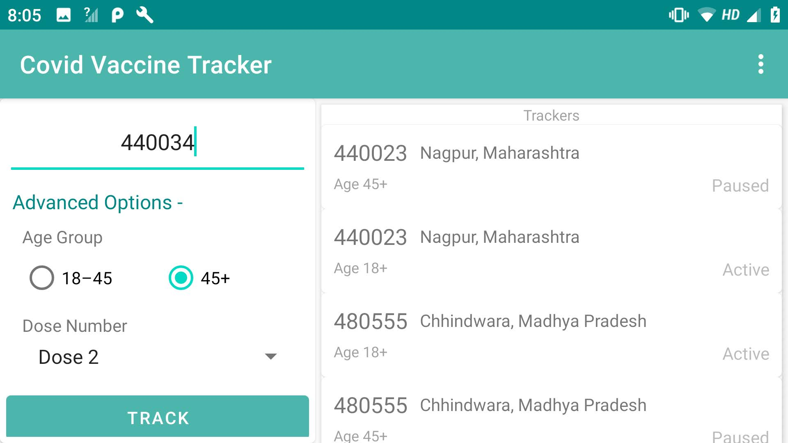

# android-covid-vaccine-tracker
Cowin vaccine tracker uses Cowin API to track available slots in next 7 days

### How does it work
1. Enter pincode
2. Choose Age preferences
3. Once your tacker is active, Sit back and relax
4. Tracker will notify whenver slot is available base on preferences you selected
5. Click on notification you will redirected to CoWin portal

# Installation Steps
1. Clone the repository
2. Import in android studio
3. Once build is successful, click "Run" icon

# Screenshots

   
    
 
